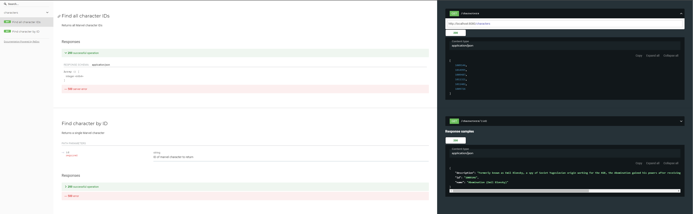

# marvel-chars
`marvel-chars` is a Marvel Characters API that serves all listed Marvel characters in Marvel.com.

## External Packages
- [github.com/go-chi/chi](github.com/go-chi/chi)
- [github.com/google/uuid](github.com/google/uuid)
- [github.com/joho/godotenv](github.com/joho/godotenv)

## Installation
Clone this repo
```
git clone https://github.com/ctacampado/marvel-chars
```
Download dependencies using `go mod`:
```
go mod download
```
## Configuring the .env File
Create a copy of `dotenv-template` and rename the copy as `.env`. It contains the ff.:
```
SVCNAME="marvelch"
HOST="0.0.0.0"
PORT="8080"
PRIVKEY=""
PUBKEY=""
API_URL="http://gateway.marvel.com/v1/public/characters?"
API_LIMIT="100"
API_INIT_OFFSET="0"
```
- `SVCNAME` is the service name.
- `PORT` is the port where the server can be accessed
- `PRIVKEY` is your marvel.com developer private key
- `PUBKEY` is your marvel.com developer public key
- `API_URL` is the marvel.com characters API
- `API_LIMIT` is the results limit when calling the marvel.com characters API
- `API_INIT_OFFSET` is the starting offset when the marvel.com characters API is called

Basically, you just have to put your private key and public key.
## Build and Run
To run
```
go run cmd/marvelch/main.go
```
To build and execute binary
```
go build cmd/marvelch/main.go
./main
```
## Serve API Documentation
I used `go-swagger` for the API documentation UI. Install [go-swagger](https://goswagger.io/install.html) and serve api documentation:
```
swagger serve api/swagger.yaml --no-ui
```
